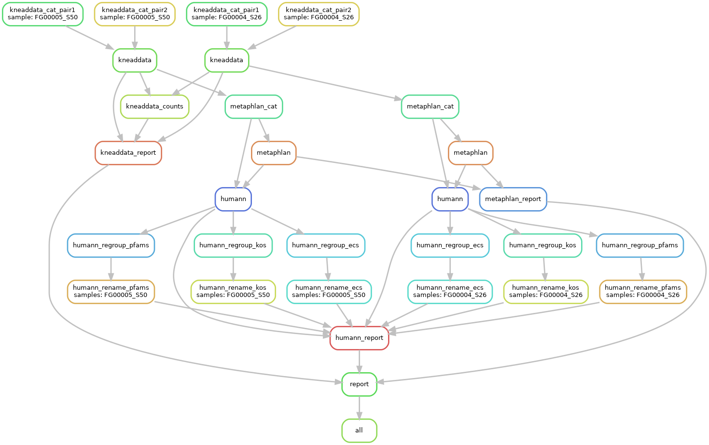

# Testing Snakemake workflows

## Files

- The `rawfastq` subdirectory contains sub-sampled sequence files (100,000 reads)
  from ECHO samples
- `cluster.yaml` and `config.yaml` are links to the templates
  in the root of this repo.
  Do not edit them directly, unless you copy them to a new location.
- This `README.md` contains information on how to run tests
  of the `snakemake` workflows.

## Running tests on `hopper`

1. Copy the contents of the `test` directory to a new location.
2. check to make sure that the commands you need are available in your `$PATH`.
   You can do this using eg `which humann`.
   The commands you need are:
   - `kneaddata`
   - `kneaddata_read_count_table`
   - `metaphlan`
   - `humann`
   - `humann_regroup_table`
   - `huamnn_rename_table`

## Run the snakemake workflow

```sh
$ snakemake -c2 -s $REPO_PATH/run.smk
```

where `$REPO_PATH` is the absolute or relative path to this repo.

Optionally, include the `--debug-dag` option to get more info
about how the rules are resolving.

Another way to debug is to visualize the DAG by running:

```
$ snakemake -s $REPO_PATH/run.smk --forceall --dag | dot -Tpng > dag.png
```


